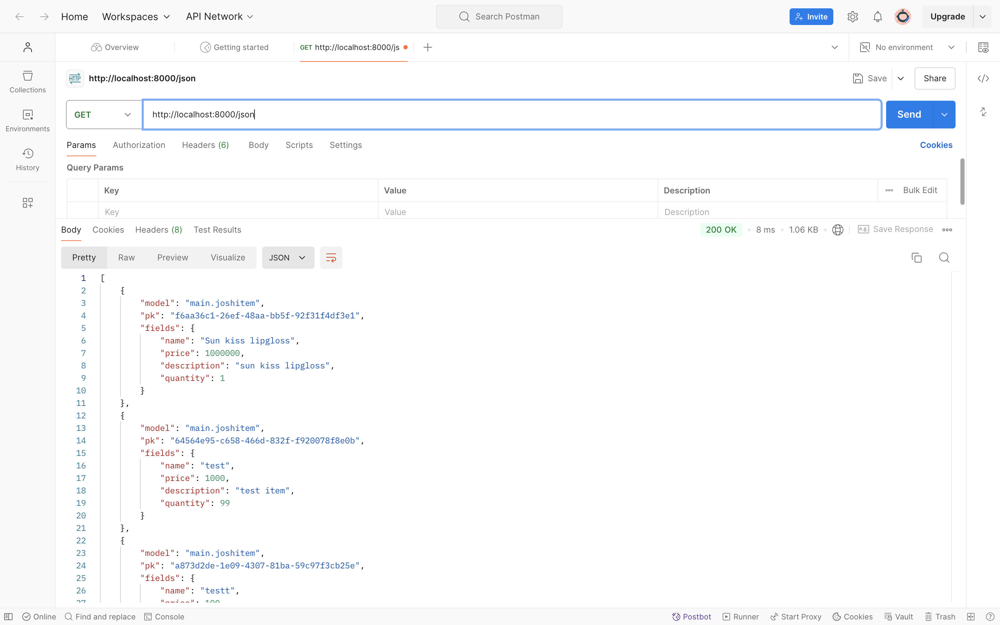

# JOSH

Link tautan menuju web: http://joshua-hans-joshapp.pbp.cs.ui.ac.id/

# Tugas 2

### 1. Jelaskan bagaimana cara kamu mengimplementasikan checklist di atas secara step-by-step.
1. Saya membuat repository github lalu saya melakukan cloning terhadap repo yang saya buat di github ke komputer lokal saya.
2. Setelah itu, saya menginstall dan menginisiasi proyek Django. Tapi, sebelum itu, saya mengaktifkan virtual environment untuk isolasi dependensi dan mempermudah pengolaan versi python.
3. Lalu saya menyiapkan dependensi yang dibutuhkan oleh proyek dalam sebuah file bernama requirements.txt dan menginstall semua dependensi tersebut.
4. Setelah itu, saya membuat menginisiasi proyek django dengan menjalankan perintah 'django-admin startproject josh_app .'
5. Setelah itu, saya mengedit ALLOWED_HOST agar saya dapat melihat hasil dari kode saya di local host komputer saya. 
6. Lalu, saya menambahkan file .gitignore dan memasukkan file-file yang tidak akan dimasukkan ke versi kontrol Git.
7. Selanjutnya saya membuat aplikasi main dan mendaftarkannya ke INSTALLED_APPS di dalam projek saya.
8. Di dalam direktori main akan ada models, urls, dan views. Saya juga membuat folder templates yang akan menyimpan templates untuk ditampilkan.
9. Di dalam templates, saya membuat main.html yang berisi konten yang akan ditampilkan di web (npm, name, class, description)
10. Selanjutnya saya mengisi bagian models.py di main app. Saya menambahkan kelas baru bernama joshShop yang memiliki atribut name (CharField), price(IntegerField), description (TextField), dan quantity (IntegerField).
11. Setelah itu, saya mengisi bagian views.py, saya import render, lalu saya membuat fungsi show_main yang berisi context yang akan ditampilkan dan merender datanya dengan template main.html
12. Selanjutnya, lalu saya mengerjakan urls.py di main app agar saya dapat menggunakan fungsi yang saya buat di views.py
13. Setelah itu, saya juga melakukan konfigurasi di urls.py di direktori josh_app (proyek).
14. Setelah itu, saya melakukan add, commit dan push ke repo github
15. Selanjutnya, saya membuat proyek baru di PWS
16. Lalu saya menambahkan URL deployment PWS ke dalam ALLOWED_HOST yang berada di settings.py direktori josh_app.
17. Selanjutnya saya melakukan project command dan push ke PWS.

### 2. Buatlah bagan yang berisi request client ke web aplikasi berbasis Django beserta responnya dan jelaskan pada bagan tersebut kaitan antara urls.py, views.py, models.py, dan berkas html.

### 3. Jelaskan fungsi git dalam pengembangan perangkat lunak!
Dengan menggunakan git, kita dapat mengola dan melacak semua perubahan kode dalam pengembangan perangkat lunak yang memungkinkan kita untuk kembali ke versi sebelumnya jika diperlukan. Git juga memungkinkan kita untuk melakukan branching yang memungkinkan pengembangan fitur baru secara terpisah dari kode utama jadi tidak mengganggu versi stabil dan menggabungkan kode dari berbagai branch setelah fitur selesai dikembangkan. Kita juga dapat menyimpan kode secara remote di GitHub untuk mempermudah sinkronisasi dan backup kode.

### 4. Menurut Anda, dari semua framework yang ada, mengapa framework Django dijadikan permulaan pembelajaran pengembangan perangkat lunak?
Menurut saya, Django dijadikan permulaan pembelajaran pengembangan perangkat lunak karena memiliki arsitektur yang terstruktur dan mudah dipahami. Django menggunakan arsitektur Model-Template-View(MTV), ini memberikan kerangka kerja yang jelas dan terorganisir, membantu pemula memahami bagaimana memisahkan logika, tampilan, dan pengolaan data. Selain itu, Django juga memiliki dokumentasi yang baik, serta komunitas yang besar sehingga ada banyak sumber daya belajar seperti tutorial dan dukungan dari komunitas online. 

### 5. Mengapa model pada Django disebut sebagai ORM?
Model pada Django disebut sebagai ORM (Object-Relational Mapping) karena berfungsi sebagai jembatan antara objek di kode Python dan tabel relasional di basis data. Django ORM memungkinkan pengembang untuk berinteraksi dengan basis data menggunakan objek Python tanpa menulis langsung query SQL, sehingga data di basis data dapat dikelola seperti objek Python.

# Tugas 3
### 1. Jelaskan mengapa kita memerlukan data delivery dalam pengimplementasian sebuah platform?
Kita memerlukan data delivery dalam pengimplementasian sebuah platform karena data dalam sebuah platform harus ditransfer dengan aman dan cepat antara pengguna dan sistem. Hal ini penting untuk menjaga keakuratan aliran informasi dalam sebuah platform. 

### 2. Menurutmu, mana yang lebih baik antara XML dan JSON? Mengapa JSON lebih populer dibandingkan XML?
Menurut saya JSON lebih baik daripada XML. JSON juga lebih populer dibandingkan dengan XML karena struktur JSON lebih mudah dibaca dan dipahami oleh manusia seperti kita, sehingga lebih mudah dalam pengembangan dan proses debuggingnya. JSON juga lebih ringkas dan efisien karena formatnya lebih sederhana (tidak ada tag pembuka dan penutup seperti XML), sehingga pemrosesan JSON biasanya lebih cepat dibandingkan dengan XML.

### 3. Jelaskan fungsi dari method is_valid() pada form Django dan mengapa kita membutuhkan method tersebut?
Method is_valid() pada form Django berfungsi untuk memeriksa apakah data yang dikirim melalui form memenuhi aturan validasi yang sudah diterapkan. Method akan mengembalikan True jika data valid, dan False jika salah. Kita butuh method ini agar hanya data yang valid yang diproses atau disimpan ke dalam databse, dan menolak data atau input yang tidak sesuai.

### 4. Mengapa kita membutuhkan csrf_token saat membuat form di Django? Apa yang dapat terjadi jika kita tidak menambahkan csrf_token pada form Django? Bagaimana hal tersebut dapat dimanfaatkan oleh penyerang?
crsf_token adalah token unik yang dihasilkan untuk setiap sesi dan juga disertakan dalam form sebagai cara untuk menverifikasi bahwa permintaan yang diterima oleh sebuah server berasal dari sumber yang sah dan diinisiasi oleh pengguna yang terautentikasi. Kita membutuhkan csrf_token saat membuat form di Django untuk mencegah dari serangan Cross Site Request Forgery (CRSF). Django secara default memeriksa keberadaan crsf_token untuk setiap permintaan POST, kalau tidak ada token ini, maka permintaan akan ditolak, dan pengguna akan menerima pesan kesalahan. Tidak adanya crsf_token juga membuka celah bagi penyerang untuk melakukan serangan CRSF. Penyerang dapat mengirimkan permintaan berbahaya yang tampak sah ke aplikasi web atas nama pengguna yang telah terautentikasi. 

### 5. Jelaskan bagaimana cara kamu mengimplementasikan checklist di atas secara step-by-step (bukan hanya sekadar mengikuti tutorial).
1. Yang pertama saya lakukan adalah folder templates, mengisinya dengan base templates yang dapat digunakan sebagai kerangaka umum, dan juga mengonfigurasi templates di settings.py. 
2. Lalu saya menambahkan id dengan mengimport uuid di models.py yang terletak di main untuk mencegah kerentanan keamanan. Tidak lupa saya melakukan migrations. 
3. Untuk membuat form, saya membuat file baru bernama forms.py dan membuat class bernama joshShopEntryForm, untuk model dan fields nya saya sesuaikan dengan yang ada di models.py
4. Setelah itu di views.py, saya mengimport dan membuat fungsi baru bernama create_item_entry yang akan menambahkan data item secara otomatis ketika form di submit. Saya juga mengubah show_main untuk mengambil seluruh objek yang tersimpan di database untuk ditampilkan di main page. 
5. Selanjutnya saya membuat create_item_entry.html pada templates di main yang mengextend base.html yang akan ditampilkan ketika user mengklik tombol untuk menambah item. Saya juga mengubah main.html untuk menampilkan data baru yang diinput oleh user di form. 
6. Setelah itu, saya juga mengimport fungsi dan menambahkan path url di urls.py di main agar dapat mengakses fungsi create_item_entry yang sudah dibuat. 
7. Selanjutnya, saya juga menambahkan fungsi di views.py yaitu show_xml, show_json yaitu fungsi yang akan mengembalikan data dalam bentuk XML ataupun JSON.
8. Saya juga menambahkan show_xml_by_id, show_json_by_id untuk melakukan filter XML ataupun JSON berdasarkan ID.
9. Setelah membuat semua fungsi tersebut, saya mengimport lagi di urls.py dan menambahkan pathnya agar fungsi dapat digunakan.
10. Setelah itu saya melakukan commit dan push ke github

### Hasil Screenshot 
#### XML

#### XML by ID

#### JSON

#### JSON by ID
